```mermaid
flowchart TD
    A[Get Location] -->|Get money-To-Fly| B(Go To Location)
    B --> C{Destination
    Studio X}
    C -->|One| D[Laptop → ok]
    C -->|Two| E[iPhone → android ? ok]
    C -->|Three| F[fa:fa-car Car → Scooter]
     -->|Party| G[Go]
  
```

```topojson
{
  "type": "FeatureCollection",
  "features": [
    {
      "type": "Feature",
      "geometry": {
        "type": "Point",
        "coordinates": [
          -122.136051,
          47.641010
        ]
      },
      "properties": {}
    }
  ]
}
```

### Hi there 👋

- 🔭 I’m currently working on building a few things..
- 🌱 I’m currently learning theoretical concepts (physics, ai, social interaction) smart contracts, some (DA TJP XVI MZVY OCDN D RDGG WPT TJP V XJAAZZ) (ⶔⶎⶌⶌⶊ)) and more! 
- 📫 How to reach me: [Warpcast](https://warpcast.com/sirlupinwatson) - [X](https://twitter.com/Sirlupinwatson)
- 😄 Pronouns: Lupin the Gentleman
- ⚡ Fun fact: Coding is fun!


I listed interesting publication I made in the past and if you work with data, data science or have any motivation around cyber defense or sybil hunting, these might be valuable for you:

-  [Gitcoin data analysis grants rounds 14 with ASOP](https://hackmd.io/UOlkSVK0QMSEsKEB3fUFjQ?view)
-  [Gitoin data analysis rounds 20](https://github.com/sirlupinwatson/GG20xOSO)
-  [Learning sybil resistance part.1](https://gov.gitcoin.co/t/learning-sybil-resistance-work-in-progress-part-1/10536)    
-  [Learning sybil resistance part.2](https://gov.gitcoin.co/t/learning-sybil-resistance-work-in-progress-part-2/10537)
-  [Learning sybil resistance part.3](https://gov.gitcoin.co/t/learning-sybil-resistance-work-in-progress-part-3/10644)


